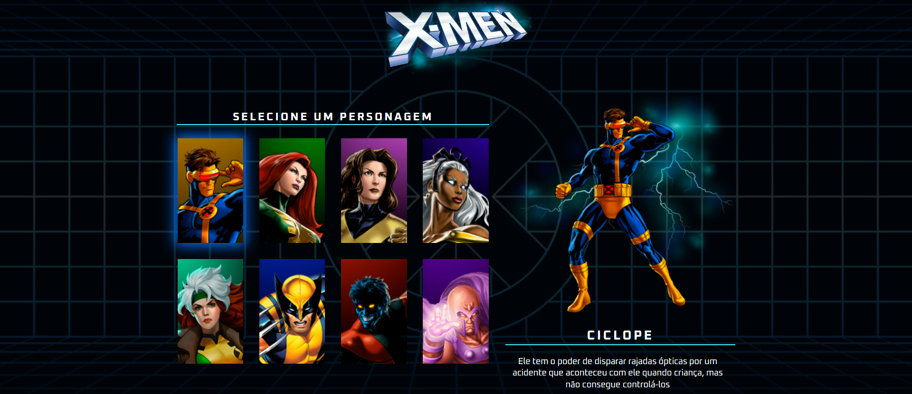

# x-men

## 🖥️ Projeto

Projeto X-MEN. O projeto foi desenvolvido utilizando a linguagem de programação JavaScript, que é amplamente utilizada para criar aplicativos web interativos e dinâmicos. O objetivo principal do projeto era selecionarmos um personagem apenas passando o mouse por cada um mostrado na tela e ao lado, a imagem, o nome e a descrição do personagem serem mostrados para o usuário. 

## 🚀 Tecnologias

Esse projeto foi desenvolvido com as seguintes tecnologias:

- HTML
- CSS
- JavaScript
